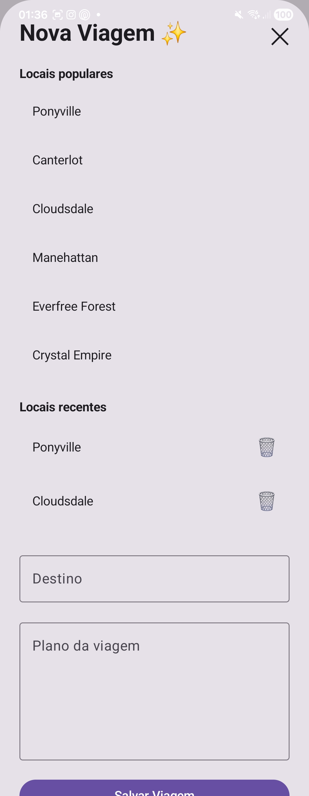
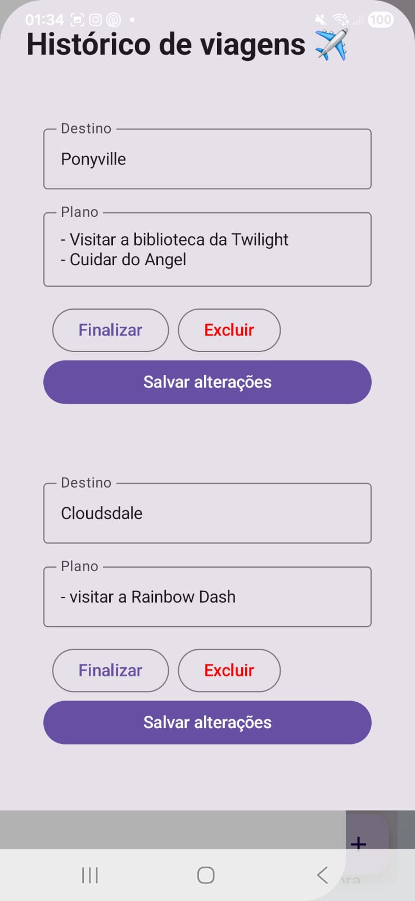

#  PonyTrip

Aplicativo Android de planejamento de viagens com tema My Little Pony, desenvolvido em Kotlin com Jetpack Compose.

---

##  Sobre o Projeto

O PonyTrip permite que usuários criem contas, planejem viagens, registrem itinerários e publiquem posts sobre suas aventuras. Cada conta tem seus próprios dados isolados — viagens, posts e lugares recentes são separados por usuário.

---

##  Funcionalidades

- **Autenticação** — cadastro e login com email e senha, persistidos via SharedPreferences
- **Splash Screen** — tela de carregamento animada com logo e gradiente
- **Viagens** — criar, editar, finalizar e excluir itinerários de viagem
- **Posts / Diário** — publicar, editar e excluir posts, podendo vincular a uma viagem específica
- **Lugares populares e recentes** — sugestões de destinos e histórico de buscas
- **Perfil** — editar nome, email e foto de perfil
- **Sidebar** — menu lateral com acesso rápido às viagens e configurações
- **Isolamento por usuário** — todos os dados são filtrados pelo email da conta logada

---

##  Scaffolding (Estrutura do Projeto)

```
PonyTravelPlanner/
│
├── app/
│   ├── src/
│   │   ├── main/
│   │   │   ├── java/com/example/ponytravelplanner2/
│   │   │   │   │
│   │   │   │   ├── MainActivity.kt         # Toda a UI em Compose (telas, modais, sidebar)
│   │   │   │   │
│   │   │   │   └── db/
│   │   │   │       └── DBHelper.kt         # SQLite: tabelas, queries, CRUD
│   │   │   │
│   │   │   ├── res/
│   │   │   │   ├── drawable/
│   │   │   │   │   └── logo.png            # Logo do app (My Little Pony)
│   │   │   │   └── values/
│   │   │   │       ├── strings.xml
│   │   │   │       └── themes.xml
│   │   │   │
│   │   │   └── AndroidManifest.xml
│   │   │
│   │   └── test/
│   │
│   └── build.gradle
│
├── build.gradle
├── settings.gradle
└── README.md
```

---

##  Banco de Dados (SQLite)

Gerenciado pela classe `DBHelper`, com 3 tabelas:

### Viagens
| Coluna      | Tipo    | Descrição                    |
|-------------|---------|------------------------------|
| id          | INTEGER | Chave primária autoincrement |
| destino     | TEXT    | Nome do destino              |
| plano       | TEXT    | Descrição do itinerário      |
| status      | TEXT    | "Nova viagem" / "Finalizada" / "Cancelada" |
| usuario_id  | INTEGER | ID do usuário (legado)       |
| email       | TEXT    | Email do dono da viagem      |

### Posts
| Coluna      | Tipo    | Descrição                    |
|-------------|---------|------------------------------|
| id          | INTEGER | Chave primária autoincrement |
| texto       | TEXT    | Conteúdo do post             |
| usuario_id  | INTEGER | ID do usuário (legado)       |
| viagem_id   | INTEGER | Viagem vinculada (opcional)  |
| email       | TEXT    | Email do dono do post        |

### LugaresRecentes
| Coluna | Tipo    | Descrição                    |
|--------|---------|------------------------------|
| id     | INTEGER | Chave primária autoincrement |
| nome   | TEXT    | Nome do lugar                |
| email  | TEXT    | Email do dono do registro    |

---

##  Telas (MainActivity.kt)

O arquivo `MainActivity.kt` contém toda a navegação e UI do app dentro de uma única função `@Composable` chamada `PonyTripApp()`, usando controle de tela por variável de estado `telaAtual`.

##  Screenshots

## 📸 Screenshots

<table>
<tr>
<td align="center">
<br>
<b>Tela de Abertura</b>
</td>

<td align="center">
<br>
<b>Login</b>
</td>

<td align="center">
<br>
<b>Cadastro</b>
</td>
</tr>

<tr>
<td align="center">
<br>
<b>Home</b>
</td>

<td align="center">
<br>
<b>Sidebar</b>
</td>

<td align="center">
<br>
<b>Posts de Viagem</b>
</td>
</tr>

<tr>
<td align="center">
<br>
<b>Nova Viagem</b>
</td>

<td align="center">
<br>
<b>Editar Perfil</b>
</td>

<td align="center">
<br>
<b>Histórico</b>
</td>
</tr>
</table>

### Componentes dentro da Home

| Componente         | Descrição                                              |
|--------------------|--------------------------------------------------------|
| TopAppBar          | Barra superior com logo e botão de menu                |
| LazyColumn         | Lista de viagens e posts                               |
| Sidebar            | Menu lateral com perfil, viagens e botão de sair       |
| FAB expandido      | Botão flutuante com opções: Novo Post / Nova Viagem    |
| Modal Nova Viagem  | Bottom sheet para criar viagem com lugares sugeridos   |
| Modal Post         | Bottom sheet para criar ou editar post                 |
| Modal Editar Perfil| Bottom sheet para alterar nome, email e foto           |
| Modal Histórico    | Bottom sheet para gerenciar viagens existentes         |
| AlertDialog Saída  | Confirmação antes de deslogar                          |

---

##  Como Rodar

1. Clone o repositório:
```bash
git clone (https://github.com/hanjimeu/PlanejadorViagens)
```

2. Abra no **Android Studio**

3. Sincronize o Gradle

4. Rode em um emulador ou dispositivo físico (Android 8.0+)

---

##  Tecnologias

| Tecnologia           | Uso                              |
|----------------------|----------------------------------|
| Kotlin               | Linguagem principal              |
| Jetpack Compose      | UI declarativa                   |
| Material3            | Componentes visuais              |
| SQLite + DBHelper    | Persistência local de dados      |
| SharedPreferences    | Sessão do usuário e foto de perfil |
| Coil                 | Carregamento de imagem de perfil |
| Coroutines / delay   | Splash screen temporizada        |

---

##  Dependências (build.gradle)

```gradle
implementation "androidx.compose.material3:material3:1.x.x"
implementation "androidx.activity:activity-compose:1.x.x"
implementation "io.coil-kt:coil-compose:2.x.x"
implementation "androidx.compose.material:material-icons-extended:1.x.x"
```

---

##  Autor

Desenvolvido por Mariana Moreira
